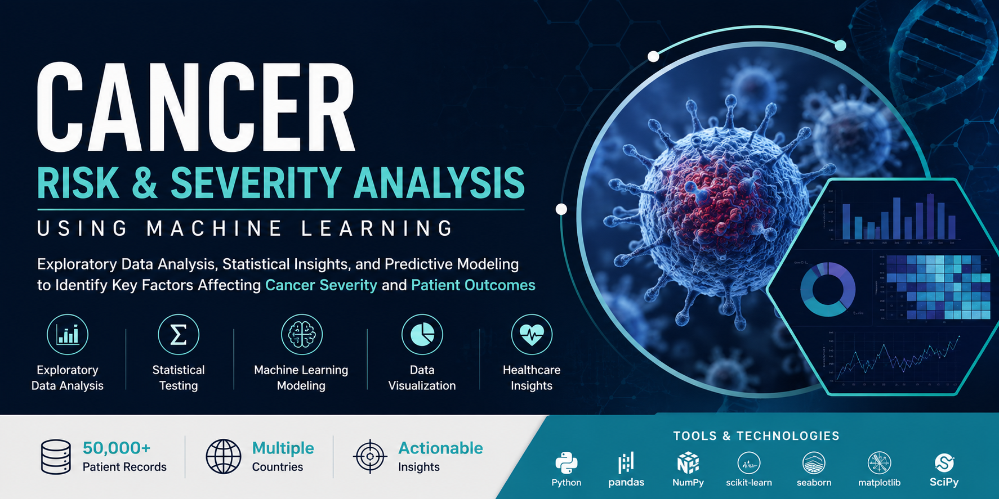
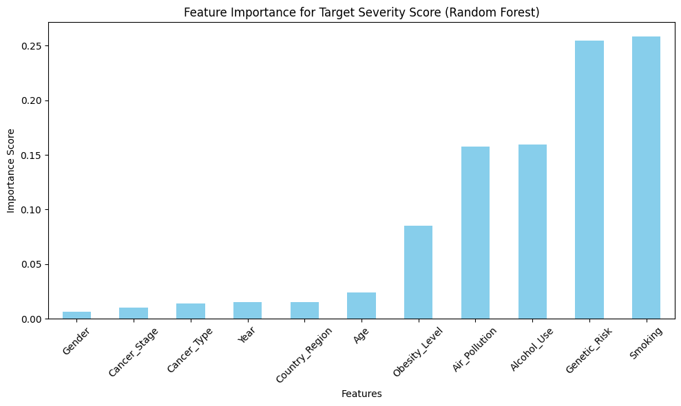
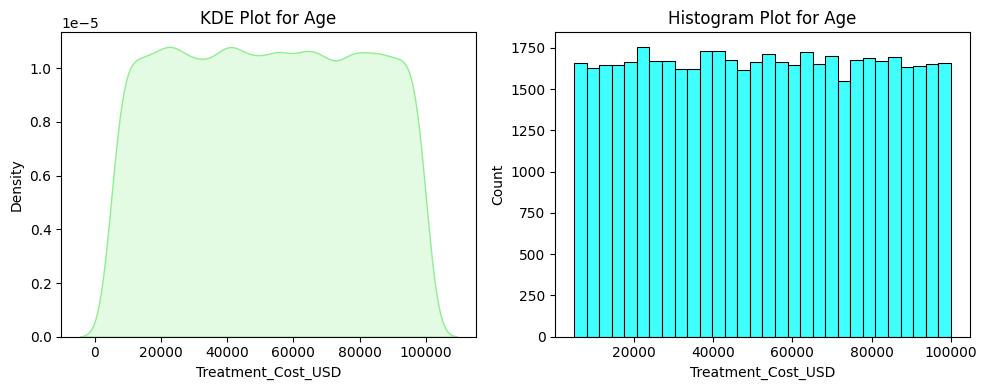
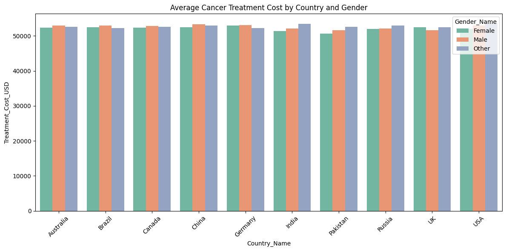
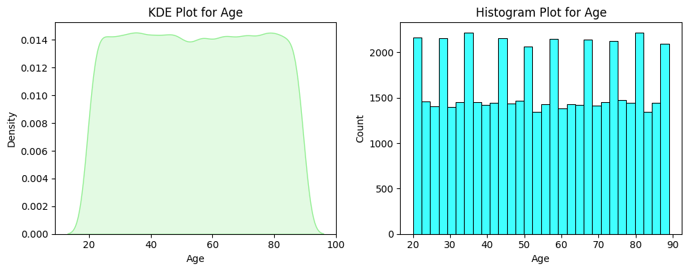
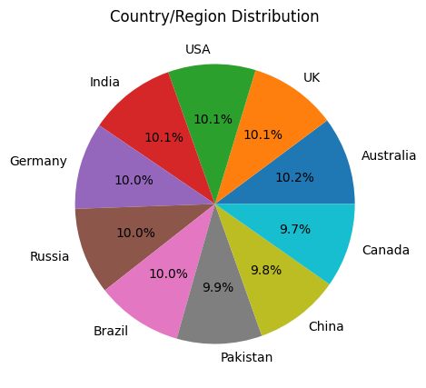
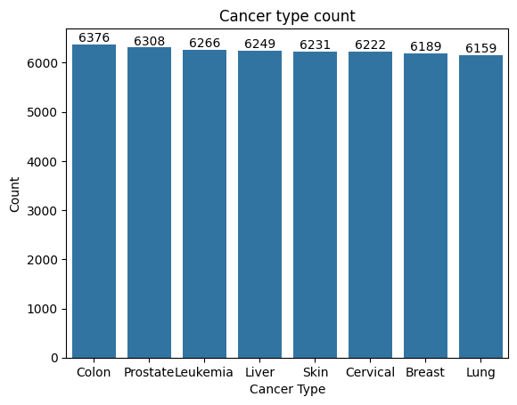
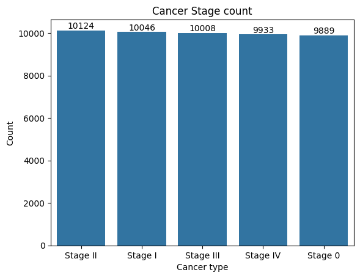
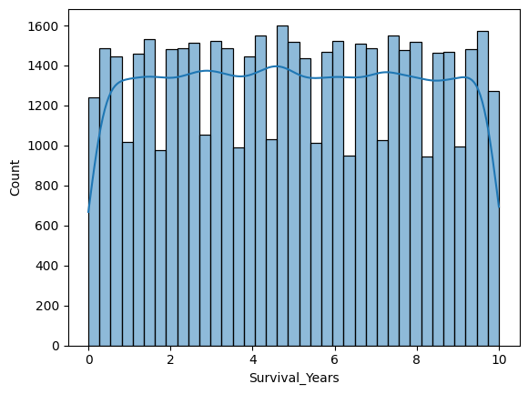
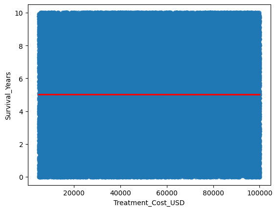

# 🩺 Global Cancer Patient Analytics: Insights into Cancer Care, Outcomes, and Disparities

📌 Project Overview

This project leverages advanced data analytics and global healthcare data to uncover actionable insights into cancer care, patient outcomes, and healthcare disparities. Using a comprehensive dataset of 50,000 cancer patient records collected across multiple countries from 2015 to 2024, the project aims to transform raw healthcare data into meaningful insights that can support data-driven decision-making in cancer research and healthcare management.

🎯 Project Vision

Cancer remains one of the leading causes of mortality worldwide. Understanding the factors that influence cancer diagnosis, treatment effectiveness, survival outcomes, and healthcare costs is critical for improving patient care.

This project combines Exploratory Data Analysis (EDA), Statistical Analysis, and Predictive Analytics to identify trends, uncover hidden relationships, and evaluate the impact of demographic, genetic, lifestyle, environmental, clinical, and economic factors on cancer outcomes.

📊 Dataset Overview

The dataset provides a comprehensive 360-degree view of cancer patients and includes the following categories:

👥 Demographic Information
Age
Gender
Country
Year of Diagnosis
🧬 Genetic & Lifestyle Risk Factors
Genetic Risk Score
Smoking Status
Alcohol Consumption
Obesity Level
🌍 Environmental Exposure
Air Pollution Exposure
🏥 Clinical & Economic Variables
Cancer Type
Cancer Stage
Treatment Cost
📈 Patient Outcomes
Survival Years
Target Severity Score
🚀 Project Objectives
1. Exploratory Data Analysis (EDA)

The primary objective is to explore and visualize the dataset to identify meaningful patterns and trends.

Key Goals:
Analyze cancer prevalence across countries and demographic groups.
Explore relationships between risk factors and cancer severity.
Visualize treatment cost distributions across cancer types and stages.
Examine survival outcomes among different patient groups.
Identify geographical and demographic disparities in diagnosis and treatment.
2. Inferential & Predictive Analytics

Statistical methods and predictive modeling techniques are applied to answer critical healthcare questions.

Research Questions
🔹 Risk Factors and Cancer Severity
What is the relationship between genetic risk, smoking, alcohol consumption, obesity, and cancer severity?
Which risk factors contribute most significantly to higher severity scores?
🔹 Early Diagnosis Analysis
What proportion of patients are diagnosed at an early stage?
How does early-stage diagnosis vary across cancer types and countries?
🔹 Survival Outcome Analysis
Which factors are the strongest predictors of survival years?
How do cancer stage and severity influence patient survival?
🔹 Economic Burden Assessment
How does treatment cost vary across countries, cancer types, and demographic groups?
Which patient groups experience the highest financial burden?
🔹 Treatment Cost vs Survival Analysis
Is higher treatment expenditure associated with longer survival outcomes?
Does increased spending result in better patient prognosis?
🔹 Cancer Stage Impact Study
Do advanced cancer stages lead to:
Higher treatment costs?
Lower survival years?
Increased severity scores?
🔹 Interaction Effect Analysis
Does higher genetic risk amplify the negative effects of smoking on:
Cancer Severity Score?
Patient Survival Years?
## Dataset Information

- Total Records: 50,000+
- Multiple Countries
- Demographic Features
- Lifestyle Risk Factors
- Medical Indicators
- Treatment Costs
- Survival Information

---

## Technologies Used

Python

Pandas

NumPy

Matplotlib

Seaborn

SciPy

Statsmodels

Scikit-Learn

Jupyter Notebook

---

## Project Workflow

### 1. Data Cleaning

- Missing value inspection
- Data validation
- Data type verification

### 2. Exploratory Data Analysis

- Demographic analysis
- Cancer stage analysis
- Severity score analysis
- Cost analysis

### 3. Statistical Analysis

- Correlation analysis
- Hypothesis testing
- Relationship analysis

### 4. Machine Learning

- Random Forest Regression
- Feature Importance Analysis
- Model Evaluation

---

## Key Visualizations

### Feature Importance Analysis

### Smoking vs Cancer Severity

### Treatment Cost by Country

### Age Distribution of Patients

### Country-wise Patient Distribution

### Cancer Type Distribution

### Cancer Stage Distribution

### Survival Years Distribution

### Treatment Cost vs Survival Analysis

### Risk Factor Analysis

## Key Findings

### Finding 1

Smoking was identified as one of the strongest predictors of cancer severity.

### Finding 2

Genetic risk showed a significant positive relationship with disease severity.

### Finding 3

Treatment costs increased substantially for advanced cancer stages.

### Finding 4

Lifestyle-related factors collectively had a stronger impact than individual factors.

### Finding 5

Machine Learning models successfully identified the most influential risk variables.

---

## Skills Demonstrated

- Data Cleaning
- Data Visualization
- Statistical Analysis
- Hypothesis Testing
- Feature Engineering
- Machine Learning
- Healthcare Analytics
- Business Insight Generation

---

## Author

Ajay Kumar
